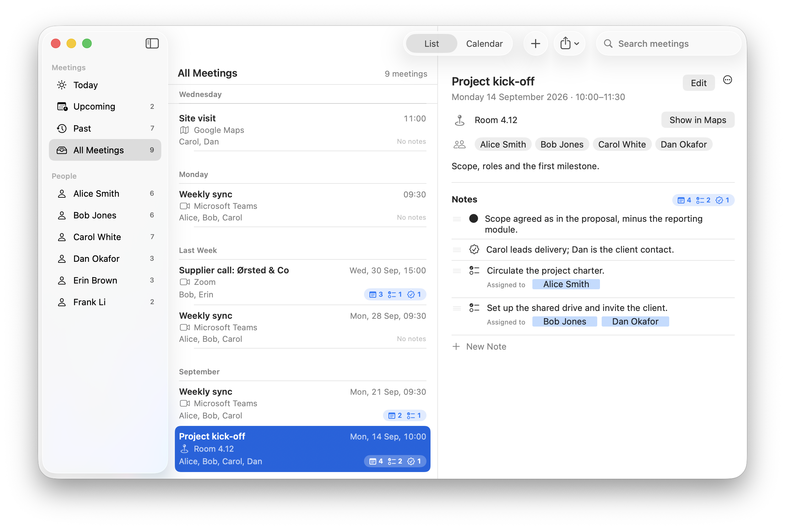

# QDVC Meetings for macOS



Keep a record of your meetings: when and where they are (a room, a Google
Maps link, or a Microsoft Teams or Zoom link), who is in them, and the notes,
decisions and action items that come out of them. A native SwiftUI app for
macOS 14 (Sonoma) and later.

Your meetings are a plain folder of small YAML files, one per meeting, so
they stay portable, greppable, and friendly to Git, Syncthing or iCloud
Drive. The format is documented in [docs/FILE_FORMAT.md](docs/FILE_FORMAT.md).

## What it does

The window has a sidebar, the meetings (as a list or a month calendar,
switched with the segmented control in the toolbar, ⌘1 / ⌘2), and the
selected meeting's pane. The layout and its precedents in Calendar,
Reminders and Mail are explained in [docs/DESIGN.md](docs/DESIGN.md).

- **Sidebar:** Today, Upcoming, Past and All Meetings, with counts, and
  everyone who has been in a meeting. Choosing a person shows their
  meetings; right-click a person to rename them in every meeting at once.
- **List:** meetings under date headings (Today, Tomorrow, the weekdays,
  Next Week, …), each showing its time, location, people and a **notes
  badge** with the number of notes, action items and decisions. Meetings
  that have happened without notes say "No notes".
- **Calendar:** a month grid, as in Calendar. Meetings with notes carry a
  notes symbol. Double-click a day to add a meeting; drag a meeting to
  another day to move it. ⌘[ and ⌘] change month, ⌘T returns to today.
- **Meeting pane:** the date and time, the location with **Join** (Teams,
  Zoom), **Open Map** (Google Maps) or **Show in Maps** (a place), your
  instructions for the platform as a callout, the people, the description,
  and the notes.
- **Notes**, edited in place as in Reminders: Return starts the next note,
  Return on an empty note stops. Each note is a plain note, an **action
  item** (⌥⌘A) or a **decision** (⌥⌘D). Action items get an "Assigned to"
  field that suggests the meeting's people first, then everyone else, and
  accepts new names. **Drag a note by its ≡ handle** to move it (or ⌥⌘↑ /
  ⌥⌘↓).
- **New Meeting** (⌘N) and **Edit Meeting** (⌘E) open a sheet with the
  title, date, start and end, location (its kind is shown as you type),
  people (with suggestions from earlier meetings) and description.
  **Duplicate Meeting** (⌘D) copies a meeting to a week later without its
  notes. **Delete Meeting** (⌘⌫) moves its file to the Trash.
- **Export** a meeting's notes as a **Word document** (⌥⌘E), as
  **Markdown**, or **Copy Notes as Plain Text** (⇧⌘C) for an email, from the
  toolbar, the File and Edit menus, or the meeting's ⋯ menu.
- **Settings** (⌘,): short instructions for Microsoft Teams and Zoom (saved
  in the workspace, so they travel with it), the default meeting length,
  and whether to reopen the last workspace.

## Requirements

- macOS 14 Sonoma or later.
- Xcode 16 or later (free from the Mac App Store). The Command Line Tools
  alone can build and run the app, but `swift test` needs full Xcode.
- No paid Apple Developer account.

## Build and run

From the repository root:

```sh
swift run                       # build and launch (debug)
swift test                      # run the unit tests
scripts/build-app.sh            # build "build/QDVC Meetings.app" (release)
scripts/build-app.sh --install  # …and copy it to ~/Applications
```

Or open the repository folder in Xcode (File → Open…, choose the folder that
contains `Package.swift`), pick the **QDVCMeetings** scheme and press ⌘R.
Xcode may ask for a team: choose **None** / **Sign to Run Locally**.

A ready-made `sample-workspace/` is included to try the app straight away
(File → Open Workspace…). Its meetings are around October 2026. Opening any
other folder, even an empty one, offers to start a workspace there.

## Signing without a paid account

`scripts/build-app.sh` signs the app **ad hoc** (`codesign --sign -`). That is
all macOS needs to run an app on the Mac that built it — no account, no
certificate, no notarisation.

A paid Developer ID is only needed to *distribute* the app so that it opens on
other Macs without a warning. If you give the ad-hoc-signed app to someone
else, macOS will block the first launch; they can allow it once in
**System Settings → Privacy & Security → Open Anyway**, or remove the
quarantine flag in Terminal:

```sh
xattr -dr com.apple.quarantine "/Applications/QDVC Meetings.app"
```

Because an ad-hoc signature changes with every build, macOS may ask again for
permission to access folders such as Documents, Desktop or iCloud Drive after
you rebuild. That is expected.

## App icon

The icon, a frosted-glass calendar card sealed with a blue two-person badge,
is generated by `tools/make_icon.py`, which follows Apple's macOS icon
template; see [docs/MAINTENANCE.md](docs/MAINTENANCE.md) §1.1. It appears in
the `.app` built by `scripts/build-app.sh`, but not when you use `swift run`,
because a bare executable has no bundle to carry it.

## Where things are stored

- Your meetings and platform instructions: only in the workspace folder you
  open, in the format described in [docs/FILE_FORMAT.md](docs/FILE_FORMAT.md).
  Every change is written to disk straight away (typing in a note, after a
  short pause).
- Preferences (default meeting length, list or calendar, recent
  workspaces): the standard macOS defaults domain
  (`defaults read org.qdvc.meetings.mac`).
- Exports: wherever you choose in the Save panel.

## Keyboard shortcuts

| Shortcut | Action |
| --- | --- |
| ⌘1 / ⌘2 | View as List / Calendar |
| ⌘N | New meeting |
| ⇧⌘N | New note in the selected meeting |
| ⌘E | Edit the selected meeting |
| ⌘D | Duplicate the selected meeting (a week later) |
| ⌘⌫ | Delete the selected meeting (to the Trash) |
| ⌘J | Join / Open Map / Show in Maps |
| ⌥⌘0 / ⌥⌘A / ⌥⌘D | Make the focused note a note / an action item / a decision |
| ⌥⌘↑ / ⌥⌘↓ | Move the focused note up / down |
| ⌥⌘E | Export notes as a Word document |
| ⇧⌘C | Copy notes as plain text |
| ⌘[ / ⌘T / ⌘] | Previous month / this month / next month (Calendar) |
| ⌥⌘R | Reveal the meeting's file in Finder |
| ⌘F | Search |
| ⌘R | Refresh from disk |
| ⌘O / ⇧⌘W | Open / close workspace |
| ⌘, | Settings |
| Double-click | A meeting: edit it. An empty day in the calendar: new meeting |

## Documentation

- **[docs/DESIGN.md](docs/DESIGN.md)** — the window, commands and decisions,
  with their precedents in Apple's apps and the Human Interface Guidelines.
- **[docs/FILE_FORMAT.md](docs/FILE_FORMAT.md)** — the workspace format:
  layout, file names and the slug, meeting files, location kinds, people,
  notes, `platforms.yml`.
- **[docs/MAINTENANCE.md](docs/MAINTENANCE.md)** — architecture, modules,
  how changes reach the disk, behaviour to preserve, tests, roadmap.

## License

No license has been chosen yet. Add a `LICENSE` file before publishing.
